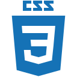
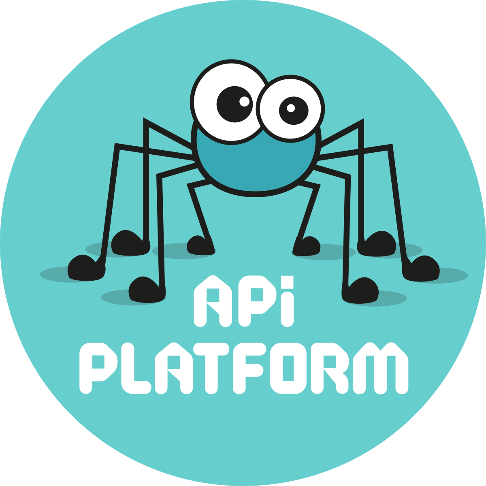

# Hello, I’m Paul PLANCQ 👋

## 🚀 About Me

Professional web developer since 2016—with a passion for code dating back to my childhood—I’m a full-stack engineer who’s now specialized in front-end development with React. My back-end and DevOps skills give me a 360° view of web architectures, enabling me to understand and optimize every layer of an application.

Clean code isn’t just a buzzword for me. I live by SOLID, DRY and KISS principles every day, striving for readability, maintainability and simplicity in every line I write.

## 🔥 Signature Projects

A comprehensive React starter kit preconfigured with ESLint, Stylelint and other tools to guarantee code quality from day one.

A lightweight React component that loads SVGs at runtime—combining the flexibility of inline SVGs with the ease of an `` tag.

My own design system under active development. Shelter-UI helps me explore UX/UI challenges and build a consistent component library and style guide for presentations, demos and POCs.

[//]: # (## ✨ Highlighted Gists)

[//]: # ()
[//]: # ([![Gist Card]&#40;./profile/useSyncExternalStore.svg&#41;]&#40;https://gist.github.com/pplancq/5c4c50e03aa76dfe3502e24263522278/&#41;)

[//]: # ([![Gist Card]&#40;./profile/withMemo.svg&#41;]&#40;https://gist.github.com/pplancq/53c55e861a4d35ddbd761bbb2b4e73cf/&#41;)

[//]: # ([![Gist Card]&#40;./profile/useHandler.svg&#41;]&#40;https://gist.github.com/pplancq/590295a46ce8bca1bff85f0915f0e761/&#41;)

## 🛠️ Tech Stack

- **Front-end:** React, JavaScript/TypeScript, CSS, React
- **Back-end:** PHP, Symfony, API Platform
- **DevOps:** Docker, Kubernetes, CI/CD (GitHub Actions, GitLab CI, Jenkins, Azure DevOps Pipelines)

## 💡 Philosophy & Workflow

I’m committed to:

- Writing clean, well-structured code
- Applying SOLID, DRY and KISS principles
- Documenting and sharing best practices

These values drive collaboration, scalability and long-term project success.

## ⭐ GitHub Stats

## 🌐 Connect with Me

I’m always excited to discuss new ideas, open-source contributions or potential collaborations:

Feel free to explore my repos, open an issue, or send a PR. Let’s push the boundaries of web development together!
